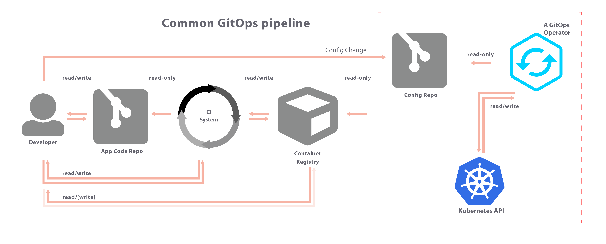

# Movie Talk infrastructure


  | Environment                                                          | Status | URL                       |
  | ----------------------------------------------------------------- | ------- | --------------------------- |
  | Test                                          | [](https://argocd.mbegley.net/applications/movietalk-test?resource=)      | [movietalk.test.mbegley.net](https://movietalk.test.mbegley.net/)
  | Stage                            | [](https://argocd.mbegley.net/applications/movietalk-stage?resource=)       | [movietalk.stage.mbegley.net](https://movietalk.stage.mbegley.net/)| 
  | Prod                                             | [](https://argocd.mbegley.net/applications/movietalk-prod?resource=)     |       [movietalk.mbegley.net](https://movietalk.mbegley.net/)                      |


## Pipeline overview



> #### GIT Ops Technologies used
>
> - Git Ops Operator: __ArgoCD__
> - CI System: __Drone.io__
> - K8s templating: __Helm__

## Dry run install
``` bash
helm install --namespace=temp --debug --dry-run --generate-name movietalk
```

## Debug templates

``` bash
helm template movietalk
```


## To install instance via helm (in memory persistance , i.e. erased after pods deleted)

create namespace

``` bash
kubectl create ns temp
```

install 
``` bash

helm install --namespace=temp --set env=temp --set tlsEnabled=false --set persistence.enabled=false --set hostName="temp.192.168.1.150.nip.io" test-demo-app movietalk

```

uninstall

``` bash
helm uninstall --namespace=temp test-demo-app
```
